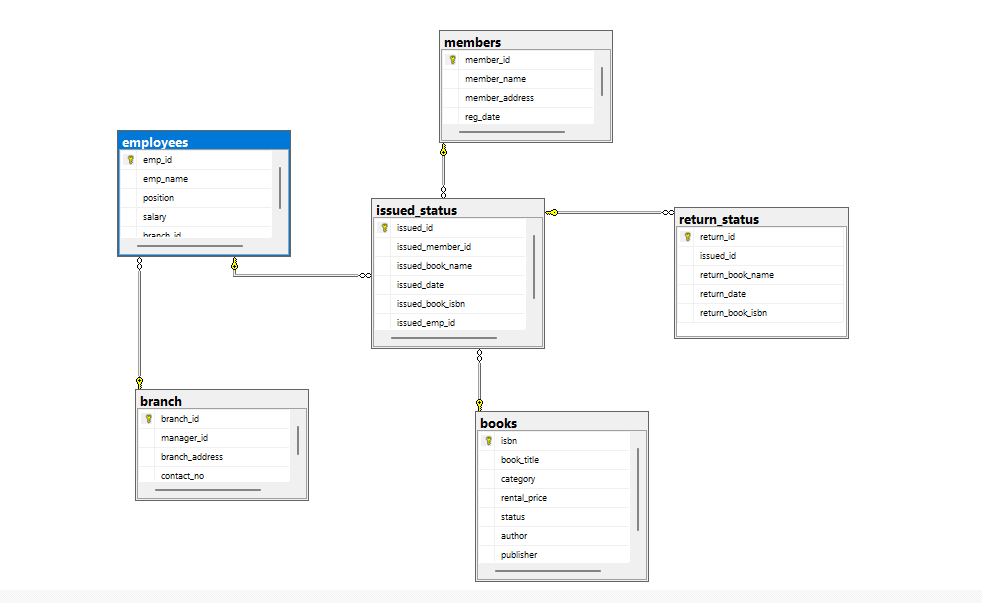

# Library Management System using SQL Project --P2

## Project Overview

**Project Title**: Library Management System  
**Database**: `Library_Project_2`

This project demonstrates the implementation of a Library Management System using SQL. It includes creating and managing tables, performing CRUD operations, and executing advanced SQL queries. The goal is to showcase skills in database design, manipulation, and querying.


## Objectives

1. **Set up the Library Management System Database**: Create and populate the database with tables for branches, employees, members, books, issued status, and return status.
2. **CRUD Operations**: Perform Create, Read, Update, and Delete operations on the data.
3. **CTAS (Create Table As Select)**: Utilize CTAS to create new tables based on query results.
4. **Advanced SQL Queries**: Develop complex queries to analyze and retrieve specific data.

## Project Structure

### 1. Database Setup


- **Database Creation**: Created a database named `Library_Project_2`.
- **Table Creation**: Created tables for branches, employees, members, books, issued status, and return status. Each table includes relevant columns and relationships.

```sql

--Creating branch table

Drop table if exists branch 
Create table branch 
	(
		branch_id varchar(20) Primary Key,
		manager_id varchar(10),
		branch_address varchar(30),
		contact_no varchar(25)
	);


-- Create table "Employee"
DROP TABLE IF EXISTS employees;
Drop table if exists employees
Create table employees
	(
	emp_id VARCHAR(15) Primary Key,
	emp_name VARCHAR(20),
	position VARCHAR(15),
	salary float,
	branch_id VARCHAR(20) --FK
	);


-- Create table "Members"
drop table if exists members
create table members
	(
		member_id varchar(10) primary key,
		member_name varchar(25),
		member_address varchar(75),
		reg_date date;


-- Create table "Books"
Drop table if exists books
Create table books
	(
		isbn varchar(20) primary key,	
		book_title varchar(75),
		category varchar(25),
		rental_price float,
		status varchar(15),
		author varchar(35),
		publisher varchar(55)
	);


-- Create table "IssueStatus"
Drop table if exists issued_status
create table issued_status
	( 
		issued_id varchar(10) primary key,
		issued_member_id varchar(10), --FK
		issued_book_name varchar(75),
		issued_date date,
		issued_book_isbn varchar(20), --FK
		issued_emp_id varchar(15) --FK
	);


-- Create table "ReturnStatus"
drop table if exists return_status
Create table return_status
	(
		return_id varchar(10) primary key,
		issued_id varchar(10),
		return_book_name varchar(75),
		return_date date,
		return_book_isbn varchar(20)
	);
-- Foreign Key

Alter table issued_status
add constraint fk_members
foreign key (issued_member_id)
references members(member_id)

Alter table issued_status
add constraint fk_books
foreign key (issued_book_isbn)
references books(isbn)

Alter table issued_status
add constraint fk_employees
foreign key (issued_emp_id)
references employees(emp_id)

Alter table employees
add constraint fk_branch
foreign key (branch_id)
references branch(branch_id)

Alter table employees
add constraint fk_branch
foreign key (branch_id)
references branch(branch_id)

Alter table return_status
add constraint fk_issued_id
foreign key (issued_id)
references issued_status(issued_id)
```

### 2. CRUD Operations

- **Create**: Inserted sample records into the `books` table.
- **Read**: Retrieved and displayed data from various tables.
- **Update**: Updated records in the `employees` table.
- **Delete**: Removed records from the `members` table as needed.

**Task 1. Create a New Book Record**
-- "978-1-60129-456-2', 'To Kill a Mockingbird', 'Classic', 6.00, 'yes', 'Harper Lee', 'J.B. Lippincott & Co.')"

```sql
insert into books(
	isbn, book_title, category, rental_price, status, author, publisher)
Values(
	'978-1-60129-456-2', 'To Kill a Mockingbird', 'Classic', 6.00, 'yes', 'Harper Lee','J.B. Lippincott & Co.')
select * from books;
```
**Task 2: Update an Existing Member's Address**

```sql
update members
set member_address = '125 Oak St'
where member_id ='C103'
select * from members;
```

**Task 3: Delete a Record from the Issued Status Table**
-- Objective: Delete the record with issued_id = 'IS121' from the issued_status table.

```sql
Delete from issued_status
where issued_id = 'IS121'
Select * from issued_status ;
```

**Task 4: Retrieve All Books Issued by a Specific Employee**
-- Objective: Select all books issued by the employee with emp_id = 'E101'.
```sql
Select * from employees
where emp_id = 'E101'
```


**Task 5: List Members Who Have Issued More Than One Book**
-- Objective: Use GROUP BY to find members who have issued more than one book.

```sql
select issued_emp_id,
	count(issued_id) as total_books 
	from issued_status
group by issued_emp_id
having count(issued_id) > 1
```

### 3. CTAS (Create Table As Select)

- **Task 6: Create Summary Tables**: Used CTAS to generate new tables based on query results - each book and total book_issued_cnt**

```sql
create table book_cnt
	(
	isbn varchar(20),
	book_title varchar(75),
	no_issued int
	)
insert into book_cnt 
	( isbn, book_title, no_issued)
select b.isbn, b.book_title,
count(ist.issued_id) as no_issued
from books as b
join
issued_status as ist
on ist.issued_book_isbn = b.isbn
group by b.isbn, b.book_title

select * from book_cnt;
```


### 4. Data Analysis & Findings

The following SQL queries were used to address specific questions:

Task 7. **Retrieve All Books in a Specific Category**:

```sql
select * from books
where category = 'Classic';
```

8. **Task 8: Find Total Rental Income by Category**:

```sql
select b.category,
	SUM(b.rental_price),
	count(*)
from books as b
join
issued_status as ist
on ist.issued_book_isbn = b.isbn
group by b.categor
```

9. **Task 9: List Members Who Registered in the Last 180 Days**:
```sql
select * from members
where reg_date >= DATEADD(day, -365, getdate());
```

10. **Task 10: List Employees with Their Branch Manager's Name and their branch details**:

```sql
select e1.emp_id,
    e1.emp_name,
    e1.position,
    e1.salary,
    b.*,
    e2.emp_name as manager
	from employees as e1
join 
branch as b
on b.branch_id = e1.branch_id
join
employees e2
on e2.emp_id = b.manager_id
```

Task 11. **Create a Table of Books with Rental Price Above a Certain Threshold**:
```sql
Drop table if exists expensive_books
CREATE TABLE dbo.expensive_books (
    isbn VARCHAR(20),
    book_title VARCHAR(75),
    category VARCHAR(25),
    rental_price FLOAT,
    status VARCHAR(15),
    author VARCHAR(35),
    publisher VARCHAR(35)
);

INSERT INTO dbo.expensive_books (
    isbn, book_title, category, rental_price, status, author, publisher
)
SELECT 
    isbn, book_title, category, rental_price, status, author, publisher
FROM 
    books
WHERE 
    rental_price > 7;


select * from expensive_books;
```

Task 12: **Retrieve the List of Books Not Yet Returned**
```sql
select * from issued_status ist
left join
return_status rs
on ist.issued_id = rs.return_id
where rs.return_id is Null;
```

## Advanced SQL Operations

**Task 13: Identify Members with Overdue Books**  
Write a query to identify members who have overdue books (assume a 30-day return period). Display the member's_id, member's name, book title, issue date, and days overdue.

```sql
select 
ist.issued_member_id,
m.member_name,
bk.book_title,
ist.issued_date,
rs.return_date,
DATEDIFF(DAY, CAST(ist.issued_date AS DATE), CAST(GETDATE() AS DATE)) AS overdue_days
from 
issued_status as ist
join
members as m
on m.member_id = ist.issued_member_id
join
books as bk
on bk.isbn = ist.issued_book_isbn
left join
return_status as rs
on rs.issued_id = ist.issued_id
where rs.return_date is null
and DATEDIFF(DAY, CAST(ist.issued_date AS DATE), CAST(GETDATE() AS DATE)) >30
order by ist.issued_id
```


**Task 14: Update Book Status on Return**  
Write a query to update the status of books in the books table to "Yes" when they are returned (based on entries in the return_status table).


```sql

Select * from issued_status
where issued_book_isbn = '978-0-451-52994-2'

Select * from books
where isbn = '978-0-451-52994-2'

Update books
set status = 'no'
where isbn = '978-0-451-52994-2'

select * from return_status
where issued_id = 'IS130'

--
Insert into return_status (return_id,issued_id,return_date)
Values
('RS125','IS130', CAST(GETDATE() AS DATE))

Update books
set status = 'yes'
where isbn = '978-0-451-52994-2'

Select * from books

--Stored Procedures
CREATE OR ALTER PROCEDURE add_return_records
    @p_return_id VARCHAR(10),
    @p_issued_id VARCHAR(10)
AS
BEGIN
    SET NOCOUNT ON;

    DECLARE 
        @v_isbn VARCHAR(50),
        @v_book_name VARCHAR(80);

    -- Insert into return_status table
    INSERT INTO return_status (return_id, issued_id, return_date)
    VALUES (@p_return_id, @p_issued_id, CAST(GETDATE() AS DATE));

    -- Get book details
    SELECT 
        @v_isbn = issued_book_isbn,
        @v_book_name = issued_book_name
    FROM issued_status
    WHERE issued_id = @p_issued_id;

    -- Update book status
    UPDATE books
    SET status = 'yes'
    WHERE isbn = @v_isbn;

    -- Print message
    PRINT 'Thank you for returning the book: ' + @v_book_name;
END;

---testing stored procedures
Select * from books
where isbn = '978-0-307-58837-1'

Select * from issued_status
where issued_book_isbn = '978-0-307-58837-1'

Select * from return_status
where issued_id = 'IS135'

Exec add_return_records 'RS138', 'IS135'

Select * 
from books
where isbn = '978-0-307-58837-1' 

Select * from return_status;

```


**Task 15: Branch Performance Report**  
Create a query that generates a performance report for each branch, showing the number of books issued, the number of books returned, and the total revenue generated from book rentals.

```sql
create table branch_reports
	(branch_id varchar(20),
	manager_id varchar(10),
	number_of_book_issued varchar(10),
	number_of_book_retruned varchar(10),
	total_revenue float)
insert into branch_reports
	( branch_id, manager_id, number_of_book_issued, number_of_book_retruned, total_revenue)
select 
	b.branch_id,
	b.manager_id,
	COUNT(ist.issued_id) as number_of_book_issued,
	COUNT(rs.return_id) as number_of_book_returned,
	SUM(bk.rental_price) as total_revenue
from issued_status as ist
join
employees as e
on ist.issued_emp_id = e.emp_id
join
branch as b
on e.branch_id = b.branch_id
left join
return_status as rs
on rs.issued_id = ist.issued_id
join
books as bk
on ist.issued_book_isbn = bk.isbn
group by b.branch_id, b.manager_id

select * from branch_reports;
```

**Task 16: CTAS: Create a Table of Active Members**  
Use the CREATE TABLE AS (CTAS) statement to create a new table active_members containing members who have issued at least one book in the last 2 months.

```sql

Create table active_members
				( member_id varchar(10),
		member_name varchar(25),
		member_address varchar(75),
		reg_date date )
insert into active_members
	( member_id, member_name, member_address, reg_date)
Select *
from members
where member_id in (Select
					distinct issued_member_id
					from issued_status
					where
					issued_date >= DATEADD(MONTH, -15, CAST(GETDATE() AS DATE))
					)

Select * from active_members;

```


**Task 17: Find Employees with the Most Book Issues Processed**  
Write a query to find the top 3 employees who have processed the most book issues. Display the employee name, number of books processed, and their branch.

```sql
select 
e.emp_name, 
b.branch_id,
b.branch_address,
b.manager_id,
COUNT(ist.issued_id) as no_book_issued
from issued_status as ist
join
employees as e
on e.emp_id = ist.issued_emp_id
join
branch as b
on b.branch_id = e.branch_id
group by e.emp_name, 
b.branch_id,
b.branch_address,
b.manager_id
```

**Task 18: Stored Procedure**
Objective:
Create a stored procedure to manage the status of books in a library system.
Description:
Write a stored procedure that updates the status of a book in the library based on its issuance. The procedure should function as follows:
The stored procedure should take the book_id as an input parameter.
The procedure should first check if the book is available (status = 'yes').
If the book is available, it should be issued, and the status in the books table should be updated to 'no'.
If the book is not available (status = 'no'), the procedure should return an error message indicating that the book is currently not available.

```sql

CREATE OR ALTER PROCEDURE issue_book
    @p_issue_id VARCHAR(10),
    @p_issued_member_id VARCHAR(10),
    @p_issued_book_isbn VARCHAR(20),
    @p_issued_emp_id VARCHAR(15)
AS
BEGIN
    SET NOCOUNT ON;

    DECLARE @v_status VARCHAR(10);

    -- Check if the book is available
    SELECT @v_status = status
    FROM books
    WHERE isbn = @p_issued_book_isbn;

    IF @v_status = 'yes'
    BEGIN
        INSERT INTO issued_status (
            issued_id,
            issued_member_id,
            issued_date,
            issued_book_isbn,
            issued_emp_id
        )
        VALUES (
            @p_issue_id,
            @p_issued_member_id,
            CAST(GETDATE() AS DATE),
            @p_issued_book_isbn,
            @p_issued_emp_id
        );

        UPDATE books
        SET status = 'no'
        WHERE isbn = @p_issued_book_isbn;

        PRINT 'Book records added successfully for book ISBN: ' + @p_issued_book_isbn;
    END
    ELSE
    BEGIN
        PRINT 'Sorry, the book is currently unavailable. ISBN: ' + @p_issued_book_isbn;
    END
END;

-- Testing The function
Select * from books;
--'978-0-553-29698-2' yes
--'978-0-375-41398-8' no
Select * from issued_status;

Exec issue_book 'IS141', 'C108', '978-0-553-29698-2', 'E104';

Exec issue_book 'IS142', 'C108', '978-0-375-41398-8', 'E104';

SELECT * FROM books
WHERE isbn = '978-0-375-41398-8'
```

## Reports

- **Database Schema**: Detailed table structures and relationships.
- **Data Analysis**: Insights into book categories, employee salaries, member registration trends, and issued books.
- **Summary Reports**: Aggregated data on high-demand books and employee performance.

## Conclusion

This project demonstrates the application of SQL skills in creating and managing a library management system. It includes database setup, data manipulation, and advanced querying, providing a solid foundation for data management and analysis.

## How to Use

1. **Clone the Repository**: Clone this repository to your local machine.
2. **Set Up the Database**: Execute the SQL scripts in the `ERD Schemas.sql` file to create and `Import Data Queries.sql` to populate the database.
3. **Run the Queries**: Use the SQL queries in the `Project Task Queries.sql` file to perform the analysis.
4. **Explore and Modify**: Customize the queries as needed to explore different aspects of the data or answer additional questions.

This project showcases SQL skills essential for database management and analysis.
